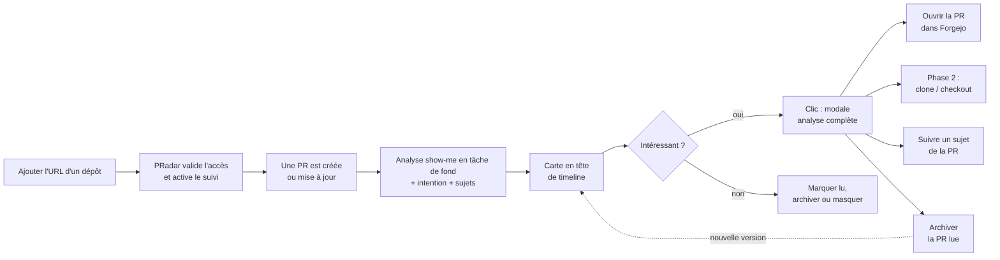
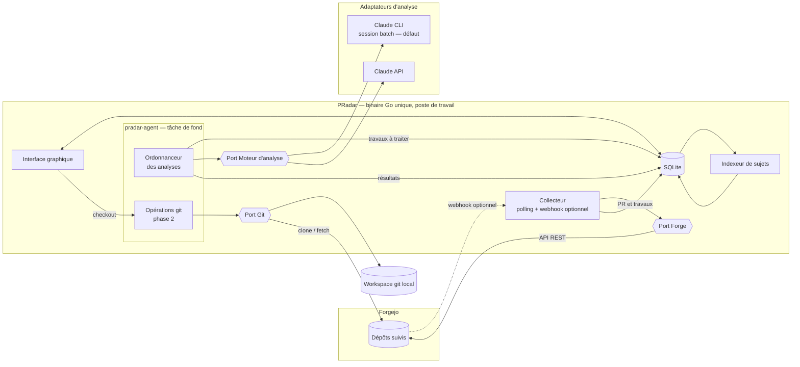
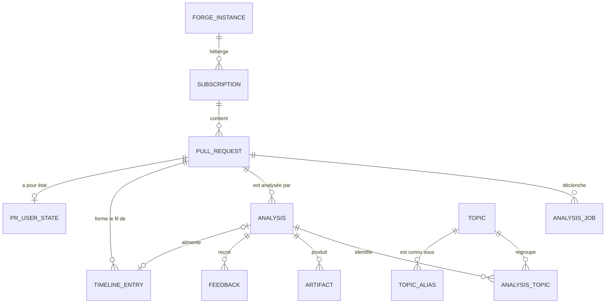

# PRD — PRadar : veille et revue assistée des pull requests Forgejo

| Champ | Valeur |
|---|---|
| Statut | Brouillon v0.2 — à challenger |
| Auteur | Clement |
| Date | 16 septembre 2026 |
| Périmètre MVP | Mono-utilisateur, client lourd (binaire Go avec interface graphique intégrée), stockage SQLite |
| Décisions à formaliser | Voir § 13 (ADR candidats) |
| Historique | Voir § 17 |

---

## 1. Résumé

PRadar est une application de bureau de veille sur les pull requests. Elle suit les dépôts Forgejo choisis par l'utilisateur et analyse chaque PR créée ou mise à jour avec le skill `show-me`. Les résultats sont enregistrés localement et organisés en fils de discussion : un fil par PR et un fil par sujet.

La vue principale est une timeline de cartes, de la plus récente à la plus ancienne. Chaque carte résume l'intention de la PR en une phrase et porte une étiquette pastel propre au dépôt. Un clic ouvre une modale qui contient l'analyse `show-me` complète et un lien vers la PR. Une fois lue, la PR peut être archivée. Dans un second temps, un bouton permettra de cloner le dépôt (ou de le mettre à jour) et de passer directement sur la branche de la PR.

L'objectif est de ne plus parcourir toutes les PR à la main et de disposer d'un flux personnel qui met en avant celles qui comptent.

## 2. Contexte et problème

Avec l'IA, la production de code s'est accélérée et le nombre de pull requests a fortement augmenté. Des agents ouvrent des PR et poussent de nouveaux commits à un rythme qu'aucun relecteur ne peut suivre. Il en découle trois difficultés :

1. **Saturation de l'attention.** La liste des PR ouvertes ne dit pas lesquelles méritent une lecture. Il faut ouvrir chaque PR pour le savoir.
2. **Coût de compréhension.** La description d'une PR, souvent générée, dit rarement *pourquoi* le changement existe ni *quelle structure* il modifie. Pour comprendre un diff, il faut reconstruire mentalement les flux d'appel, les dépendances et l'arborescence touchée.
3. **Perte du fil transverse.** Un même sujet (authentification, pipeline CI, schéma d'API…) est souvent traité dans plusieurs PR et plusieurs dépôts. Forgejo ne propose aucune vue par sujet.

Les notifications natives de Forgejo (abonnement « watch », courriels) signalent qu'un événement a eu lieu. Elles n'aident ni à trier ni à comprendre.

## 3. Objectifs et non-objectifs

### 3.1 Objectifs

| # | Objectif |
|---|---|
| O1 | Réduire le nombre de PR à ouvrir manuellement pour savoir si elles comptent. |
| O2 | Permettre de comprendre en moins d'une minute l'intention et les changements structurants d'une PR, grâce aux représentations visuelles de `show-me`. |
| O3 | Suivre un sujet à travers plusieurs PR et plusieurs dépôts. |
| O4 | Donner un accès direct à la PR d'origine dans Forgejo puis, en phase 2, au code local sur la bonne branche. |
| O5 | Rester simple : un binaire Go unique qui intègre l'interface graphique et s'appuie sur une base SQLite bien conçue. Aucune infrastructure à exploiter. |
| O6 | Rester indépendant des fournisseurs : l'accès à la forge et le moteur d'IA sont abstraits derrière des ports et des adaptateurs. |

### 3.2 Non-objectifs (MVP)

- Remplacer la revue humaine. PRadar aide à trier et à comprendre ; il n'approuve ni ne rejette aucune PR.
- Écrire dans Forgejo (commentaires, approbations, labels). L'outil reste en lecture seule.
- Proposer une application web ou un service hébergé. PRadar est un client lourd.
- Gérer plusieurs utilisateurs, des rôles ou du partage. Voir les évolutions au § 11.
- Prendre en charge d'autres forges (GitHub, GitLab…) au MVP. L'accès à la forge passe par un **port** (architecture hexagonale), dont Forgejo est le premier adaptateur. Le même principe s'applique aux **moteurs et modèles d'IA** (§ 7.2).
- Analyser les fils de commentaires et de revue des PR. C'est un candidat pour la v2.

## 4. Utilisateur cible et cas d'usage

**Persona principal.** Un architecte ou tech lead qui suit plusieurs dépôts Forgejo où contribuent des humains et des agents. Il veut repérer les changements structurants (architecture, sécurité, contrats d'API, infrastructure) sans lire chaque diff.

**Tâches à accomplir (jobs-to-be-done)**

- *Quand* j'ouvre ma veille le matin, *je veux* voir d'abord les PR qui me concernent, *afin de* consacrer mon temps de revue aux bonnes PR.
- *Quand* une PR attire mon attention, *je veux* comprendre visuellement son intention et sa structure, *afin de* décider en quelques secondes si je la relis en détail.
- *Quand* je suis un sujet (par exemple « migration OIDC »), *je veux* voir dans l'ordre toutes les PR qui y contribuent, *afin de* garder une vision d'ensemble.
- *Quand* je décide de relire une PR, *je veux* accéder directement à la PR puis, plus tard, au code sur la bonne branche, *afin de* passer à l'action sans friction.
- *Quand* j'ai lu et traité une PR, *je veux* l'archiver, *afin qu'elle* quitte ma timeline tout en restant consultable, et qu'elle y revienne si elle évolue.

## 5. Parcours utilisateur



## 6. Exigences fonctionnelles

Priorités : **M** = indispensable au MVP, **S** = souhaitable au MVP, **P2** = phase 2.

### 6.1 Abonnements aux dépôts

| ID | Exigence | Prio |
|---|---|---|
| SUB-01 | L'utilisateur s'abonne à un dépôt en collant son URL (`https://<forge>/<owner>/<repo>`, avec ou sans `.git` ; un lien vers une PR est aussi accepté). L'outil en déduit l'instance, le propriétaire et le nom du dépôt. | M |
| SUB-02 | À l'ajout, l'outil vérifie par l'API que le dépôt existe et qu'il est lisible avec le jeton configuré. Sinon, il affiche une erreur explicite : dépôt introuvable, droits insuffisants ou instance inconnue. | M |
| SUB-03 | À l'ajout, l'utilisateur choisit le périmètre initial : analyser toutes les PR ouvertes, les *N* plus récentes, ou aucune. Par défaut : les 10 plus récentes. | S |
| SUB-04 | La liste des abonnements affiche l'état (actif, en pause, en erreur), le mode de collecte, la date de dernière synchronisation et la couleur du dépôt. | M |
| SUB-05 | L'utilisateur peut mettre en pause, reprendre ou supprimer un abonnement. La suppression retire aussi le webhook créé par l'outil, s'il y en a un. | M |
| SUB-06 | Plusieurs instances Forgejo sont prises en charge, chacune avec son URL et son jeton. | S |
| SUB-07 | Filtres par abonnement : ignorer les PR en brouillon (WIP), ignorer certains auteurs (bots de dépendances, par exemple), ne suivre que certaines branches cibles. | S |

### 6.2 Collecte des événements

PRadar tourne sur un poste de travail, qui n'est pas toujours joignable depuis Forgejo et pas toujours allumé. La collecte repose donc d'abord sur l'interrogation périodique de l'API. Les webhooks restent une option.

| ID | Exigence | Prio |
|---|---|---|
| ING-01 | **Polling (mode principal).** L'outil interroge périodiquement la liste des PR de chaque dépôt, triée par date de mise à jour. Il détecte les créations, les changements de `head` (SHA), de titre, de description et d'état. L'intervalle est configurable ; il vaut 5 min par défaut. | M |
| ING-02 | **Rattrapage.** Au démarrage de l'application, et après une mise en veille, une synchronisation complète rattrape les événements manqués. | M |
| ING-03 | **Webhook (option).** Si le poste est joignable par Forgejo et que le jeton permet d'administrer le dépôt, l'outil peut créer un webhook sur les événements *pull request*, synchronisation des commits comprise. Chaque livraison est authentifiée par sa signature HMAC-SHA256 ; une livraison non signée ou mal signée est rejetée et journalisée. | S |
| ING-04 | Événements qui déclenchent une analyse : ouverture, réouverture, nouveaux commits, modification du titre ou de la description. La fermeture et la fusion produisent une entrée d'état, sans nouvelle analyse. | M |
| ING-05 | **Anti-rebond.** Les agents poussent souvent plusieurs commits d'affilée. Les événements d'une même PR sont regroupés pendant une fenêtre configurable (10 min par défaut), puis seul le dernier `head` est analysé. | M |
| ING-06 | **Idempotence.** Une analyse est identifiée par le quadruplet (PR, SHA de `head`, version du prompt, moteur). Une analyse déjà produite n'est pas relancée. Une contrainte d'unicité en base garantit cette règle (§ 7.4). | M |
| ING-07 | **Rejeu.** L'utilisateur peut relancer l'analyse d'une PR, d'un dépôt ou d'une période, par exemple après un changement de prompt ou de moteur. | S |

### 6.3 Analyse avec `show-me`

**Rappel sur le skill.** `show-me` (dépôt `humanlayer/skills`) aide à comprendre un sujet *visuellement*, avec la plus petite représentation qui rende le point clair : pseudocode, arbres d'appels, arbres de composants, arborescences de fichiers, diagrammes Mermaid, diffs ciblés et, si besoin, artefacts HTML. Il n'est **pas** conçu pour résumer une PR, lui attribuer des sujets ou juger de sa pertinence. PRadar l'utilise donc dans une étape d'analyse qui produit en plus ses propres sorties structurées.

**Mode d'exécution.** Par défaut, les analyses tournent en **sessions batch de la CLI Claude**, lancées en tâche de fond par `pradar-agent`, sans interaction. Un mode **API** est prévu. Les deux modes sont des adaptateurs du même port « moteur d'analyse » (§ 7.2) : le choix se fait par configuration, et le modèle d'IA est un paramètre de l'adaptateur.

| ID | Exigence | Prio |
|---|---|---|
| ANA-01 | Pour chaque PR à analyser, l'outil récupère par le port Forge les métadonnées (titre, description, auteur, branches, labels, état, brouillon), la liste des fichiers modifiés, les commits et le diff. | M |
| ANA-02 | **Choix du mode.** Le mode (CLI batch par défaut, ou API) et le modèle se choisissent dans les réglages, globalement et, en option, par abonnement. | M |
| ANA-03 | **Prérequis.** Au démarrage, l'adaptateur actif vérifie ses prérequis : pour la CLI, qu'elle est installée et authentifiée et que le skill `show-me` est disponible ; pour l'API, que la clé est valide. L'interface signale tout manque et indique comment le corriger. | M |
| ANA-04 | **Exécution en tâche de fond.** Les sessions CLI sont non interactives. Leur nombre simultané est plafonné (1 par défaut) et leur durée est limitée. Elles tournent dans un espace de travail temporaire contenant une copie en lecture seule du dépôt au `head` de la PR, avec des outils limités à la lecture. | M |
| ANA-05 | Le moteur charge le skill `show-me` et produit le **corps de l'analyse** : Markdown avec blocs Mermaid, pseudocode, arbres et diffs ciblés. | M |
| ANA-06 | Le moteur produit aussi des **métadonnées structurées**, validées par un schéma (§ 7.3) : `intent` (une ou deux phrases, 280 caractères au plus, pour l'aperçu de la carte) ; `topics` (1 à 5 sujets, chacun avec un libellé et un résumé d'une phrase) ; `importance` (`low` / `medium` / `high`) ; `risk_flags` (par exemple `breaking-api`, `security`, `migration`, `infra`) ; `relevance` (score de 0 à 1, cf. § 6.7). | M |
| ANA-07 | **Analyse incrémentale.** Lors d'une mise à jour, l'analyse indique aussi ce qui a changé depuis la dernière version analysée (diff entre l'ancien et le nouveau `head`). | S |
| ANA-08 | **Garde-fous de volume.** Les fichiers générés, les lockfiles, les binaires et les chemins configurés sont exclus. Au-delà d'un seuil de taille de diff, l'analyse se limite aux fichiers les plus significatifs et le signale. Un plafond journalier d'analyses s'applique. | M |
| ANA-09 | La langue des analyses est configurable ; le français est la langue par défaut. | S |
| ANA-10 | Chaque analyse enregistre sa provenance : adaptateur, modèle, version du skill (commit de `humanlayer/skills`), version du prompt et durée. La consommation (tokens, coût estimé) est enregistrée quand l'adaptateur la fournit. | M |
| ANA-11 | En cas d'échec (délai dépassé, sortie invalide, quota atteint), l'outil réessaie avec un délai croissant. S'il échoue encore, il crée une carte « analyse indisponible » qui conserve le lien vers la PR. | M |
| ANA-12 | Les artefacts HTML éventuellement produits par `show-me` sont conservés à part et rattachés à l'analyse. | S |

### 6.4 Fils de discussion par sujet

| ID | Exigence | Prio |
|---|---|---|
| FIL-01 | Chaque analyse est enregistrée selon le contrat versionné `pradar.analysis.v1` (§ 7.3). | M |
| FIL-02 | **Fil par PR.** Toutes les analyses et tous les changements d'état d'une PR forment un fil ordonné. | M |
| FIL-03 | **Fil par sujet.** Chaque sujet identifié ajoute une entrée au fil de ce sujet. Un fil de sujet peut donc réunir des PR de plusieurs dépôts. | M |
| FIL-04 | **Normalisation des sujets.** Avant de créer un sujet, l'outil cherche une correspondance parmi les sujets existants (slug, alias, similarité), pour éviter qu'ils prolifèrent. L'utilisateur peut fusionner ou renommer des sujets. | S |
| FIL-05 | La rétention est configurable (90 jours par défaut pour les analyses). Les PR archivées et les sujets suivis peuvent être conservés plus longtemps. | S |

### 6.5 Interface graphique (client lourd)

L'interface graphique fait partie du binaire Go : il n'y a ni serveur web ni navigateur à ouvrir. Le choix de la bibliothèque graphique relève de la conception (ADR-004). Elle doit cependant savoir afficher du Markdown, des diagrammes Mermaid et des blocs de code avec coloration.

#### Timeline

| ID | Exigence | Prio |
|---|---|---|
| UI-01 | La vue principale est une **timeline à défilement infini**, de la carte la plus récente à la plus ancienne. Les nouvelles cartes s'ajoutent en tête dès qu'elles sont prêtes. Un indicateur « N nouvelles » évite de déplacer la lecture en cours. | M |
| UI-02 | Chaque **carte de résultat** affiche : l'étiquette du dépôt, le titre et le numéro de la PR, l'**aperçu d'intention** (`intent`), l'auteur, l'horodatage relatif, le type d'événement (nouvelle PR, mise à jour, fusionnée, fermée), l'importance et les indicateurs de risque. | M |
| UI-03 | **Étiquette de dépôt en couleur pastel.** Chaque dépôt reçoit une couleur tirée d'une palette de 12 teintes pastel bien distinctes. L'attribution est déterministe (hash du nom complet) et l'utilisateur peut la modifier. Le texte reste lisible (contraste ≥ 4,5:1, WCAG AA). Le nom du dépôt figure toujours dans l'étiquette, pour que la couleur ne porte jamais seule l'information. Une variante est prévue pour le mode sombre. | M |
| UI-04 | Les sujets de la PR apparaissent en puces sur la carte. Un clic sur une puce ouvre le fil du sujet. | M |
| UI-05 | Filtres : « Pour moi » (pertinence au-dessus du seuil) ou « Tout », dépôt, sujet, importance, état de la PR, lu ou non lu, archivé. Recherche plein texte sur le titre, l'intention et les sujets. | M (filtres), S (recherche) |
| UI-06 | Les mises à jour successives d'une PR sont regroupées : la timeline montre la dernière analyse, avec un compteur « 3 versions » qui déplie le fil de la PR. | S |
| UI-07 | Actions rapides sur chaque carte : marquer comme lu, archiver, masquer, suivre le sujet (§ 6.6). | M |

#### Modale de détail

| ID | Exigence | Prio |
|---|---|---|
| UI-08 | Un clic sur la carte ou sur son étiquette ouvre une **modale**. Elle contient l'en-tête de la PR (dépôt, titre, auteur, branches `head → base`, état), l'intention, puis le **contenu `show-me`** mis en forme : Markdown, diagrammes Mermaid, blocs de code et diffs colorés. | M |
| UI-09 | Un bouton bien visible, **« Ouvrir la PR dans Forgejo »**, ouvre l'URL de la PR dans le navigateur par défaut. | M |
| UI-10 | **« Archiver »** est disponible dans la modale ; l'archivage ferme la modale et passe à la carte suivante. | M |
| UI-11 | Si la PR a été mise à jour, un sélecteur permet de passer d'une version d'analyse à l'autre et d'afficher la section « ce qui a changé depuis ». | S |
| UI-12 | Les artefacts HTML de `show-me` s'affichent dans un contexte isolé, sans accès à l'application ni au réseau. Le Markdown est assaini avant d'être affiché (§ 8.1). | M si ANA-12 |
| UI-13 | Retour sur la pertinence : « utile » ou « pas pour moi », pour calibrer le score (§ 6.7). | S |
| UI-14 | Bouton **« Cloner / checkout »** (§ 6.8). | P2 |
| UI-15 | Navigation au clavier : `j`/`k` pour passer d'une carte à l'autre, `Entrée` pour ouvrir, `o` pour ouvrir la PR, `e` pour archiver, `Échap` pour fermer. La modale est accessible (gestion du focus, lecteurs d'écran). | S |

#### Vues secondaires

| ID | Exigence | Prio |
|---|---|---|
| UI-16 | **Vue Sujets** : liste des sujets actifs avec le nombre de PR, la dernière activité et les dépôts concernés. Un clic ouvre le fil du sujet sous forme de timeline filtrée. | M |
| UI-17 | **Vue Archives** : PR archivées, avec recherche, filtres et désarchivage. | M |
| UI-18 | **Vue Abonnements** : gestion décrite au § 6.1. | M |
| UI-19 | **Vue Activité** : analyses en attente, en cours et en échec, avec la consommation du jour et du mois. | S |
| UI-20 | **Vue Réglages** : instances Forgejo et jetons, mode d'analyse et modèle, profil d'intérêt (§ 6.7), fenêtre d'anti-rebond, plafonds, langue, palette. | M |

#### Maquette indicative

```text
┌─────────────────────────────────────────────────────────────────────┐
│ PRadar   [Pour moi ▾] [Dépôt ▾] [Sujet ▾] [Non lus]   🔍   ⚙        │
├─────────────────────────────────────────────────────────────────────┤
│                         ▲ 2 nouvelles                                │
│ ┌─────────────────────────────────────────────────────────────────┐ │
│ │ (platform/gateway)  #142 Rotation automatique des certificats   │ │
│ │ Remplace le reload manuel par un watcher inotify et recharge     │ │
│ │ le listener TLS à chaud.                                         │ │
│ │ ● high  ⚠ security   #pki  #tls        agent-bot · il y a 4 min  │ │
│ │                                          [✓ lu] [🗄 archiver]     │ │
│ └─────────────────────────────────────────────────────────────────┘ │
│ ┌─────────────────────────────────────────────────────────────────┐ │
│ │ (infra/charts)  #87 Mise à jour · 3 versions                     │ │
│ │ Ajoute les PodDisruptionBudgets manquants aux charts.            │ │
│ │ ● medium   #kubernetes  #résilience       alice · il y a 1 h     │ │
│ │                                          [✓ lu] [🗄 archiver]     │ │
│ └─────────────────────────────────────────────────────────────────┘ │
└─────────────────────────────────────────────────────────────────────┘
```

Les exemples de la maquette sont fictifs.

### 6.6 Lecture et archivage

| ID | Exigence | Prio |
|---|---|---|
| LEC-01 | Une PR peut être marquée lue ou non lue. L'ouverture de la modale la marque lue ; ce comportement est désactivable. | M |
| LEC-02 | **Archiver** une PR la retire de la timeline par défaut. Elle reste consultable dans la vue Archives et dans les fils de sujet. L'action est disponible sur la carte, dans la modale et au clavier. | M |
| LEC-03 | **Désarchiver** remet la PR dans la timeline. | M |
| LEC-04 | **Retour automatique.** Quand une nouvelle version d'une PR archivée est analysée, la PR revient dans la timeline, avec la mention « mise à jour depuis l'archivage » et un accès direct à la section « ce qui a changé depuis ». Ce comportement est désactivable. | M |
| LEC-05 | **Archivage automatique (option).** Les PR fusionnées ou fermées, déjà lues, peuvent être archivées automatiquement. | S |
| LEC-06 | **Masquer** se distingue d'archiver : une PR masquée ne revient pas dans la timeline, même si elle est mise à jour. Elle reste visible avec le filtre « Tout ». | S |
| LEC-07 | Archivage groupé : archiver toutes les cartes lues de la vue en cours. | S |

### 6.7 Pertinence (« PR susceptibles de m'intéresser »)

La pertinence combine deux types de signaux : des signaux déterministes, explicables et peu coûteux, et un signal sémantique produit pendant l'analyse.

| ID | Exigence | Prio |
|---|---|---|
| REL-01 | **Profil d'intérêt** déclaratif : identifiant Forgejo de l'utilisateur, chemins ou globs surveillés (`charts/**`, `**/auth/**`), labels, auteurs, mots-clés, et une description libre des centres d'intérêt, transmise à l'analyse. | M |
| REL-02 | **Signaux déterministes** : revue demandée à l'utilisateur, mention, fichiers dans les chemins surveillés, labels suivis, taille du changement, fichiers sensibles (CI, sécurité, schémas, manifestes d'infrastructure). | M |
| REL-03 | **Signal sémantique** : le moteur évalue, dans `relevance`, l'adéquation entre l'analyse et la description libre des intérêts. | M |
| REL-04 | Le score final est une combinaison pondérée et configurable. La carte peut expliquer « pourquoi cette PR ? » en listant les signaux qui ont joué. | M (score), S (explication) |
| REL-05 | Les retours « utile » et « pas pour moi » ajustent le profil. Au MVP, un ajustement simple suffit : ajout ou retrait de mots-clés et de chemins. | S |
| REL-06 | La pertinence ne supprime aucune PR : le filtre « Tout » les montre toutes. | M |

### 6.8 Phase 2 : clone et checkout en un clic

PRadar est un client lourd qui tourne sur le poste de travail. Les opérations git sont donc exécutées localement par **`pradar-agent`**, avec les identifiants git déjà configurés sur le poste (agent SSH, gestionnaire d'identifiants). PRadar ne stocke aucun de ces identifiants.

| ID | Exigence | Prio |
|---|---|---|
| GIT-01 | Le bouton « Cloner / checkout » demande à `pradar-agent` d'exécuter l'opération. La demande contient l'URL de clone, le numéro de PR, la branche `head` et le dépôt d'origine de cette branche (même dépôt ou fork). | P2 |
| GIT-02 | Le répertoire cible est déterministe : `<racine_workspace>/<instance>/<owner>/<repo>`, avec une racine configurable. | P2 |
| GIT-03 | **Dépôt absent** : `git clone`, puis passage sur la branche de la PR. | P2 |
| GIT-04 | **Dépôt présent** : vérification que le remote correspond, puis `git fetch`, passage sur la branche et `git pull --ff-only`. L'option `--ff-only` empêche toute fusion implicite non voulue. | P2 |
| GIT-05 | **PR venant d'un fork ou du flux AGit** : la branche n'existe pas dans le dépôt cible. L'agent récupère alors la référence `refs/pull/<n>/head` dans une branche locale `pr/<n>`. C'est aussi le chemin par défaut quand la branche a été supprimée. | P2 |
| GIT-06 | **Arbre de travail modifié** : l'agent refuse l'opération et l'explique clairement. Au MVP, il ne fait ni stash ni reset automatique. Un `git stash` explicite pourra être proposé en option. | P2 |
| GIT-07 | La modale affiche le résultat. En cas de succès : chemin local, branche, SHA et commande `cd` à copier. En cas d'échec : un message git lisible. Plus tard : « Ouvrir dans l'IDE ». | P2 |
| GIT-08 | Option : utiliser `git worktree` (un répertoire par PR) pour relire plusieurs PR en parallèle sans toucher à la branche de travail. | P2 (option) |

Pseudocode de référence :

```text
checkout(pr):
  dest = root / pr.forge_host / pr.owner / pr.repo
  if not exists(dest):
      git clone pr.clone_url dest
  else:
      assert remote_url(dest, "origin") == pr.clone_url   # sinon erreur
      git -C dest fetch origin --prune
  if is_dirty(dest):
      return Error("Modifications locales non commitées — opération annulée")
  if pr.head_repo == pr.base_repo and remote_branch_exists(pr.head_branch):
      git -C dest switch pr.head_branch     # crée la branche de suivi si besoin
      git -C dest pull --ff-only
  else:                                       # fork, AGit, branche supprimée
      git -C dest fetch origin +refs/pull/{pr.index}/head:refs/remotes/origin/pr/{pr.index}
      if not local_branch_exists(dest, "pr/{pr.index}"):
          git -C dest switch -c pr/{pr.index} origin/pr/{pr.index}
      else:
          git -C dest switch pr/{pr.index}
          git -C dest merge --ff-only origin/pr/{pr.index}  # échoue proprement si l'auteur a réécrit l'historique
  return Ok(path=dest, branch=current_branch(dest), sha=head_sha(dest))
```

> Si l'auteur de la PR a réécrit l'historique (force-push), l'avance rapide échoue. L'agent le signale et propose de réinitialiser la branche locale, ce qui exige une confirmation explicite.

## 7. Architecture et modèle de données

Cette section fixe les principes structurants. Le détail technique sera traité dans le document de conception.

### 7.1 Vue d'ensemble



**Composants**

| Composant | Rôle |
|---|---|
| Interface graphique | Intégrée au binaire Go. Affiche la timeline, la modale, les vues secondaires et les réglages, en lisant et en écrivant dans SQLite. |
| Collecteur | Interroge Forgejo par le port Forge, reçoit éventuellement les webhooks, détecte les changements, applique l'anti-rebond et crée les travaux d'analyse dans SQLite. |
| SQLite | Source de vérité unique : abonnements, PR, analyses, sujets, fils, état de lecture et d'archivage, file des travaux d'analyse, consommation (§ 7.4). |
| Indexeur de sujets | Normalise les sujets proposés par le moteur et alimente les fils par sujet. |
| `pradar-agent` | Tâche de fond lancée par le même binaire. Elle prend les travaux dans SQLite et exécute les analyses par le port Moteur d'analyse, en sessions batch de la CLI Claude par défaut. En phase 2, elle exécute aussi les opérations git locales. Elle continue de travailler quand la fenêtre est fermée (comportement à confirmer, § 14). |

### 7.2 Principes : ports et adaptateurs

Le domaine (abonnements, PR, analyses, sujets, pertinence, archivage) ne dépend d'aucune technologie externe. Chaque dépendance passe par une interface (**port**) et au moins une implémentation (**adaptateur**), choisie par configuration.

| Port | Responsabilité | Adaptateur MVP | Adaptateurs envisagés |
|---|---|---|---|
| Forge | Lire les dépôts, les PR, les diffs et les commits ; gérer les webhooks | Forgejo (API v1) | Gitea, GitLab, GitHub |
| Moteur d'analyse | Produire une analyse conforme à `pradar.analysis.v1` à partir d'une PR | **Claude CLI en session batch** (défaut) et **Claude API** | Autres fournisseurs, modèle auto-hébergé, tout harnais compatible `SKILL.md` |
| Stockage | Persister et interroger le modèle de données | SQLite | — |
| Git | Cloner, mettre à jour et changer de branche en local | Binaire `git` du poste | Bibliothèque git native |
| Secrets | Conserver les jetons et les clés | Trousseau du système d'exploitation | Fichier chiffré |

Le contrat de sortie (§ 7.3) est identique pour les deux adaptateurs. Changer de mode, ou de modèle, ne modifie ni le domaine ni l'interface.

### 7.3 Contrat de sortie du moteur d'analyse (`pradar.analysis.v1`)

```json
{
  "schema": "pradar.analysis.v1",
  "pr_ref": "forge.example.org/platform/gateway#142",
  "head_sha": "9f2c1ab…",
  "previous_sha": "41d07e3…",
  "status": "ok",
  "intent": "Remplace le reload manuel par un watcher inotify et recharge le listener TLS à chaud.",
  "importance": "high",
  "risk_flags": ["security"],
  "relevance": { "score": 0.86, "reasons": ["semantic: rotation de certificats"] },
  "topics": [
    { "slug": "pki-tls", "label": "PKI / TLS", "summary": "Rechargement à chaud des certificats." }
  ],
  "show_me_markdown": "## Flux de rechargement\n… (Markdown, blocs Mermaid, pseudocode, diffs) …",
  "since_last": "Ajout d'un test d'intégration ; le délai de debounce passe à 2 s.",
  "artifacts": [
    { "media_type": "text/html", "name": "overview.html" }
  ],
  "provenance": {
    "adapter": "claude-cli-batch",
    "model": "…",
    "skill_ref": "humanlayer/skills@<commit>",
    "prompt_version": "2026-09-01",
    "duration_ms": 41230,
    "usage": { "tokens_in": 38211, "tokens_out": 2904, "cost_estimate": null },
    "truncated": false
  }
}
```

`status` vaut `ok` ou `unavailable` (échec, ANA-11). Les changements d'état d'une PR (fusion, fermeture) ne passent pas par le moteur : ils sont enregistrés directement dans le fil de la PR. Les raisons déterministes de la pertinence (REL-02) sont calculées par PRadar et fusionnées avec `relevance.reasons`.

### 7.4 Modèle de données (SQLite)

**Principes**

- **Source de vérité unique** : un fichier SQLite dans le répertoire de données de l'utilisateur, propre à chaque système d'exploitation.
- **Schéma simple et normalisé.** Les listes peu interrogées (labels, `risk_flags`, filtres) sont stockées en JSON ; tout ce qui sert au filtrage a sa propre colonne.
- **Migrations versionnées**, embarquées dans le binaire et appliquées au démarrage.
- **Mode WAL**, pour que l'interface lise pendant que `pradar-agent` écrit.
- **Idempotence par contraintes d'unicité** : une PR par dépôt ; une analyse par (PR, `head`, version du prompt, adaptateur).
- **File des travaux dans une table** : état, nombre de tentatives, date de première exécution possible (`not_before`, qui porte l'anti-rebond), prise en charge atomique.
- **Timeline** servie par un index sur la date décroissante, avec une pagination par curseur.
- **Recherche plein texte** par une table FTS5 (titre, intention, sujets).
- **Rétention** appliquée par une purge périodique. Les artefacts volumineux sont stockés en fichiers à côté de la base et référencés par chemin et empreinte.
- **Sauvegarde et export** : copie cohérente de la base ; export et import des abonnements et des réglages en YAML.



| Table | Colonnes principales | Contraintes et index |
|---|---|---|
| `forge_instance` | `id`, `base_url`, `kind` (`forgejo`), `username`, `secret_ref` (référence dans le trousseau) | `UNIQUE(base_url)` |
| `subscription` | `id`, `instance_id`, `owner`, `repo`, `color`, `collect_mode`, `status`, `filters` (JSON), `analysis_adapter`, `model`, `llm_policy`, `last_synced_at` | `UNIQUE(instance_id, owner, repo)` |
| `pull_request` | `id`, `subscription_id`, `number`, `title`, `body`, `author`, `state`, `draft`, `base_ref`, `head_ref`, `head_repo`, `head_sha`, `labels` (JSON), `html_url`, `clone_url`, `updated_at` | `UNIQUE(subscription_id, number)` |
| `analysis_job` | `id`, `pr_id`, `head_sha`, `status` (`pending`, `running`, `done`, `failed`), `attempts`, `not_before`, `adapter`, `last_error`, `created_at` | index `(status, not_before)` ; un seul travail actif par PR |
| `analysis` | `id`, `pr_id`, `head_sha`, `previous_sha`, `version`, `status`, `intent`, `importance`, `risk_flags` (JSON), `relevance_score`, `relevance_reasons` (JSON), `show_me_md`, `since_last_md`, `adapter`, `model`, `skill_ref`, `prompt_version`, `duration_ms`, `tokens_in`, `tokens_out`, `cost_estimate`, `created_at` | `UNIQUE(pr_id, head_sha, prompt_version, adapter)` |
| `topic` | `id`, `slug`, `label`, `followed`, `merged_into_id`, `last_activity_at` | `UNIQUE(slug)` |
| `topic_alias` | `alias`, `topic_id` | `UNIQUE(alias)` |
| `analysis_topic` | `analysis_id`, `topic_id`, `summary` | clé primaire `(analysis_id, topic_id)` ; index `(topic_id)` |
| `timeline_entry` | `id`, `pr_id`, `analysis_id` (optionnel), `kind` (`opened`, `updated`, `merged`, `closed`, `unavailable`), `occurred_at` | index `(occurred_at DESC)`, `(pr_id, occurred_at)` |
| `pr_user_state` | `pr_id`, `read_at`, `archived_at`, `hidden`, `resurfaced_at` | clé primaire `(pr_id)` ; index `(archived_at)` |
| `feedback` | `id`, `analysis_id`, `verdict` (`useful`, `not_for_me`), `created_at` | — |
| `artifact` | `id`, `analysis_id`, `media_type`, `path`, `sha256`, `size` | — |
| `usage_ledger` | `day`, `adapter`, `analyses`, `tokens_in`, `tokens_out`, `cost_estimate` | clé primaire `(day, adapter)` |
| `setting` | `key`, `value` (JSON) | clé primaire `(key)` |
| `search_index` | table virtuelle FTS5 : `title`, `intent`, `topics` | — |

**Lecture des fils**

- **Fil d'une PR** : entrées de `timeline_entry` de la PR, triées par date.
- **Fil d'un sujet** : analyses liées au sujet par `analysis_topic`, jointes à leurs entrées de timeline et triées par date décroissante.
- **Timeline principale** : entrées de `timeline_entry`, par date décroissante, en excluant les PR archivées ou masquées, sauf filtre contraire. Pour une même PR, seule l'entrée la plus récente est affichée (UI-06).
- **Retour après archivage** (LEC-04) : quand une nouvelle analyse est créée pour une PR archivée, `archived_at` est remis à vide et `resurfaced_at` est renseigné.

### 7.5 API Forgejo utilisée par l'adaptateur (MVP)

Endpoints de l'API v1, dont la compatibilité reste à vérifier sur la version de Forgejo visée :

- `GET /repos/{owner}/{repo}` : validation de l'abonnement ;
- `GET /repos/{owner}/{repo}/pulls?state=open&sort=recentupdate` : polling ;
- `GET /repos/{owner}/{repo}/pulls/{index}` : métadonnées ;
- `GET /repos/{owner}/{repo}/pulls/{index}.diff` : diff ;
- `GET /repos/{owner}/{repo}/pulls/{index}/files` et `/commits` : fichiers et commits ;
- `GET /repos/{owner}/{repo}/compare/{base}...{head}` : diff incrémental entre deux SHA (ANA-07) ;
- `POST|DELETE /repos/{owner}/{repo}/hooks` : webhook optionnel, qui exige les droits d'administration.

## 8. Exigences non fonctionnelles

### 8.1 Sécurité

- **Contenu non fiable.** Le titre, la description, le code et les commentaires d'une PR peuvent être hostiles (injection de prompt). Les sessions d'analyse tournent sans secret dans leur environnement, avec des outils en lecture seule, dans un espace de travail temporaire supprimé après usage.
- **Affichage.** Le Markdown est assaini (liste blanche de balises, pas de HTML brut). Mermaid est configuré en mode strict. Les artefacts HTML sont isolés (UI-12). Les liens s'ouvrent dans le navigateur par défaut.
- **Jetons Forgejo** : portée minimale, c'est-à-dire lecture des dépôts, plus l'administration seulement si l'outil crée des webhooks. Ils sont stockés dans le trousseau du système et jamais écrits en clair dans SQLite ni dans les journaux.
- **Webhook optionnel** : désactivé par défaut. Une fois activé, il écoute sur une adresse et un port configurables, et chaque livraison doit porter une signature HMAC valide, avec un secret propre à chaque dépôt.
- **Opérations git (P2)** : écriture limitée à la racine du workspace ; l'URL de clone doit appartenir à une instance déclarée ; aucune opération destructive sans confirmation.

### 8.2 Performance et fiabilité

| Indicateur | Cible indicative |
|---|---|
| Délai entre un changement dans Forgejo et l'apparition de la carte | ≤ intervalle de polling + fenêtre d'anti-rebond + 5 min (p95) |
| Démarrage de l'application | < 2 s |
| Affichage de la timeline (50 cartes) | < 1 s |
| Apparition d'une nouvelle carte dans l'interface | < 2 s après l'enregistrement de l'analyse |
| Perte d'événement | Aucune : rattrapage au démarrage et synchronisation complète périodique |
| Empreinte sur le poste | Sessions d'analyse simultanées plafonnées ; faible consommation au repos |

### 8.3 Coût et quotas

- Plafonds configurables : nombre d'analyses par jour, sessions simultanées et, en mode API, coût mensuel estimé.
- Premiers leviers d'économie : anti-rebond (ING-05), exclusions (ANA-08) et idempotence (ING-06).
- Quand un quota est atteint (quota de la CLI ou de l'API), les travaux restent en attente et reprennent automatiquement. L'interface l'indique.
- Option à évaluer : un modèle léger pour le tri (importance, pertinence), et un modèle plus capable pour le corps `show-me`, réservé aux PR au-dessus d'un seuil de pertinence.

### 8.4 Confidentialité et souveraineté

- Le code des PR est transmis au moteur d'analyse. Pour chaque instance ou dépôt, il faut documenter s'il peut être envoyé à un fournisseur de modèle externe.
- Une politique par abonnement (`llm_policy`) empêche d'analyser un dépôt sensible avec un adaptateur non autorisé.
- Le port Moteur d'analyse et la portabilité du skill (Markdown) laissent ouverte l'option d'un modèle auto-hébergé.

### 8.5 Observabilité

- Journaux structurés locaux, avec rotation, corrélés par PR et par travail d'analyse.
- Vue Activité (UI-19) : travaux en attente, en cours et en échec, erreurs récentes, consommation.
- Export de diagnostic (journaux et état de la file, sans secrets) pour faciliter le support.

### 8.6 Distribution et installation

- Un binaire Go unique par plateforme ; l'interface graphique et les migrations SQLite sont embarquées. Les plateformes visées sont à confirmer (§ 14).
- Prérequis : `git` et, selon l'adaptateur, la CLI Claude authentifiée avec le skill `show-me` installé, ou une clé API. Ils sont vérifiés au premier lancement (ANA-03).
- Configuration par l'interface, stockée dans SQLite ; import et export en YAML.
- Lancement au démarrage de la session et icône dans la zone de notification : en option.
- Rejeu d'analyses (ING-07) après un changement de prompt ou d'adaptateur.

### 8.7 Accessibilité et ergonomie

- Timeline et modale utilisables entièrement au clavier, avec un contraste conforme à WCAG 2.2 AA et un focus visible.
- Modes clair et sombre, avec une palette pastel déclinée pour chacun.
- Fenêtre redimensionnable ; la mise en page s'adapte aux petites largeurs.

## 9. Mesures de succès

| Mesure | Définition | Cible indicative après 1 mois |
|---|---|---|
| PR ouvertes manuellement pour le tri | PR consultées dans Forgejo sans passer par une carte | − 70 % par rapport à la situation actuelle (à mesurer avant le lancement) |
| Précision de « Pour moi » | Part des cartes « Pour moi » jugées utiles | ≥ 70 % |
| Rappel de « Pour moi » | Part des PR jugées importantes après coup qui figuraient dans « Pour moi » | ≥ 90 % |
| Compréhension | Part des analyses notées « utile » | ≥ 75 % |
| Timeline tenue à jour | Part des PR lues puis archivées | Suivi de tendance |
| Fraîcheur | Délai p95 entre changement et carte | Conforme au § 8.2 |
| Consommation | Analyses par jour et coût ou quota consommé | Sous les plafonds fixés |

## 10. Jalons

| Jalon | Contenu | Critère de sortie |
|---|---|---|
| **M0 — Spike** | Chaîne complète sur un dépôt : API Forgejo, session batch de la CLI Claude avec `show-me`, sortie `pradar.analysis.v1` validée. Évaluation qualitative sur 20 PR réelles. Comparaison rapide avec l'adaptateur API. | Le contrat de sortie est stable et la qualité est jugée suffisante. |
| **M1 — Cœur** | Ports et adaptateurs (Forge, Moteur d'analyse, Stockage, Secrets), schéma SQLite et migrations, collecteur (polling et rattrapage), anti-rebond, file de travaux, `pradar-agent`, provenance et plafonds. | Une PR créée ou mise à jour produit une analyse enregistrée dans le délai cible. |
| **M2 — Interface** | Timeline, cartes, étiquettes pastel, modale `show-me`, lien vers la PR, lecture et archivage, filtres, vues Sujets, Archives et Réglages. | Usage quotidien réel pendant 2 semaines. |
| **M3 — Pertinence** | Profil d'intérêt, score combiné, explication, retours utilisateur. | Précision ≥ 70 %. |
| **M4 — Phase 2 : checkout** | Port Git, opérations dans `pradar-agent` (clone, fetch et pull, forks et AGit, garde-fous), retour dans la modale ; option worktree. | Checkout réussi sur des PR internes et sur des PR de forks. |
| **Au-delà** | Webhook, analyse des commentaires de revue, notifications système, résumé périodique, autres forges et autres moteurs. | — |

## 11. Évolutions envisagées après le MVP

- **Multi-utilisateur ou partage** : profils séparés, partage de fils de sujet.
- **Exposition des résultats** à d'autres consommateurs (outils, agents, tableaux de bord), par un port de publication dédié.
- **Résumé périodique** par sujet, quotidien ou hebdomadaire.
- **Notifications système** pour les PR à la fois très pertinentes et importantes.
- **Revue assistée** : analyse des fils de commentaires, détection des questions restées sans réponse.
- **Liens avec les ADR** : signaler qu'une PR touche une décision documentée.
- **Autres forges** (Gitea, GitLab, GitHub) et **autres moteurs d'IA**, sous forme de nouveaux adaptateurs.

## 12. Risques et mitigations

| Risque | Impact | Mitigation |
|---|---|---|
| `show-me` n'est pas conçu pour le traitement en lot : sa qualité et son format varient. | Cartes inégales, affichage cassé. | Prompt d'encadrement, sortie validée par le schéma, jeu d'évaluation de référence (M0), prompt versionné. |
| Le comportement ou le format de sortie de la CLI change d'une version à l'autre. | Analyses en échec. | Adaptateur isolé, tests de contrat, version minimale vérifiée au démarrage, repli possible sur l'adaptateur API. |
| Quota de la CLI ou de l'API atteint quand les PR sont nombreuses. | Retard des analyses. | Plafonds, anti-rebond, priorité aux PR pertinentes, reprise automatique. |
| Poste éteint ou en veille. | Aucune analyse pendant ce temps. | Rattrapage au démarrage (ING-02) ; délai assumé pour un client lourd. |
| Webhook peu praticable sur un poste de travail (joignabilité, exposition réseau). | Détection moins immédiate. | Polling comme mode principal, webhook optionnel et désactivé par défaut. |
| Injection de prompt par le contenu de la PR. | Analyse manipulée, fuite d'informations. | Sessions sans secret, en lecture seule, dans un workspace temporaire ; affichage assaini ; pertinence déterministe indépendante du LLM. |
| Bibliothèque graphique Go mal adaptée à l'affichage du Markdown, de Mermaid et du HTML. | Modale pauvre ou complexe à développer. | ADR-004 et prototype d'affichage dès M0. |
| Écarts d'API selon les versions de Forgejo. | Intégration fragile. | Adaptateur Forge dédié, tests de contrat sur la version visée. |
| Prolifération des sujets. | Vue Sujets illisible. | Normalisation (FIL-04), fusion manuelle, taxonomie modifiable. |
| Code confidentiel envoyé à un modèle externe. | Non-conformité. | Politique par abonnement (§ 8.4), adaptateur auto-hébergé possible. |
| Checkout destructeur sur le poste. | Perte de travail local. | Refus si l'arbre de travail est modifié, `--ff-only`, aucune réinitialisation sans confirmation. |
| Pertinence mal calibrée. | PR importantes manquées. | Filtre « Tout » toujours disponible, mesure du rappel, retours utilisateur. |

## 13. Décisions à formaliser (ADR candidats)

| ADR | Question |
|---|---|
| ADR-001 | Collecte sur un poste de travail : polling principal, rattrapage, webhook optionnel et exposition réseau. |
| ADR-002 | Port Moteur d'analyse : contrat, adaptateurs CLI batch (défaut) et API, sélection du modèle. |
| ADR-003 | Schéma SQLite : migrations, file de travaux, rétention, recherche plein texte, stockage des artefacts. |
| ADR-004 | Bibliothèque graphique intégrée au binaire Go (webview embarquée ou toolkit natif) et affichage du Markdown, de Mermaid et du HTML. |
| ADR-005 | Affichage sécurisé du contenu généré. |
| ADR-006 | `pradar-agent` : cycle de vie de la tâche de fond (même processus ou processus séparé), communication avec l'interface, opérations git. |
| ADR-007 | Organisation hexagonale du code Go : domaine, ports, adaptateurs, injection de la configuration. |
| ADR-008 | Stockage des secrets : trousseau du système et solution de repli. |

## 14. Questions ouvertes

1. **Plateformes** : Linux seulement, ou aussi macOS et Windows ?
2. **Fenêtre fermée** : `pradar-agent` doit-il continuer d'analyser, avec une icône dans la zone de notification, ou s'arrêter avec l'application ?
3. **Instances Forgejo** : une seule, ou plusieurs dès le MVP ? Quelle version visée ?
4. **Mode d'analyse par défaut** : la CLI en session batch est retenue. Faut-il pouvoir choisir le mode ou le modèle par abonnement dès le MVP ?
5. **Dépôts sensibles** : certains dépôts doivent-ils être exclus de tout moteur externe ?
6. **Artefacts HTML de `show-me`** : les accepter dès le MVP, ou se limiter au Markdown et à Mermaid pour réduire la surface de risque ?
7. **PR en brouillon et PR de bots** (Renovate, agents) : analysées par défaut, ou filtrées ?
8. **Archivage** : le retour automatique d'une PR archivée (LEC-04) doit-il se déclencher à chaque nouveau commit, ou seulement pour les changements jugés importants ?
9. **Rétention** : 90 jours suffisent-ils, ou faut-il un historique long par sujet ?
10. **Retours de pertinence** : ajustement manuel des règles, ou apprentissage automatique des poids à terme ?

## 15. Glossaire

| Terme | Définition |
|---|---|
| Carte | Élément de la timeline qui représente un résultat d'analyse ou un changement d'état d'une PR. |
| Étiquette de dépôt | Pastille de couleur pastel qui porte le nom du dépôt. |
| Fil (thread) | Suite ordonnée d'entrées sur une même PR ou un même sujet. |
| Sujet | Thème fonctionnel ou technique repéré dans une PR et normalisé dans une taxonomie. |
| Archivage | Retrait volontaire d'une PR lue de la timeline ; elle reste consultable et revient si elle évolue. |
| Anti-rebond | Regroupement des événements rapprochés d'une même PR avant l'analyse. |
| Port / adaptateur | Interface du domaine (port) et implémentation interchangeable de cette interface (adaptateur), selon l'architecture hexagonale. |
| `pradar-agent` | Tâche de fond de PRadar qui exécute les analyses et, en phase 2, les opérations git locales. |
| Session batch | Exécution non interactive de la CLI Claude, lancée en tâche de fond pour une analyse. |
| AGit | Flux de contribution de Forgejo qui crée une PR par un push sur `refs/for/<branche>`, sans branche dédiée ni fork. |

## 16. Références

- Skill `show-me` — humanlayer/skills : <https://github.com/humanlayer/skills/blob/main/plugins/show-me/skills/show-me/SKILL.md>
- Forgejo — webhooks : <https://forgejo.org/docs/latest/user/webhooks/>
- Forgejo — Actions, événements `pull_request` (v15.0) : <https://forgejo.org/docs/v15.0/user/actions/reference/>
- Gitea — webhooks (types d'événements, valeurs `action`, signature), base historique de Forgejo : <https://docs.gitea.com/usage/repository/webhooks/>

## 17. Historique des versions

| Version | Date | Changements |
|---|---|---|
| v0.1 | 16/09/2026 | Premier brouillon (nom de travail « Vigie PR »). |
| v0.2 | 16/09/2026 | Nouveau nom : PRadar. Retrait de toute solution de messagerie : la persistance repose sur SQLite. Client lourd : l'interface graphique est intégrée au binaire Go. Ports et adaptateurs pour la forge et les moteurs d'IA. Analyses en sessions batch de la CLI Claude, lancées en tâche de fond par `pradar-agent`, avec un mode API possible. Ajout de la lecture et de l'archivage (§ 6.6). Polling comme mode de collecte principal. Modèle de données SQLite (§ 7.4). |