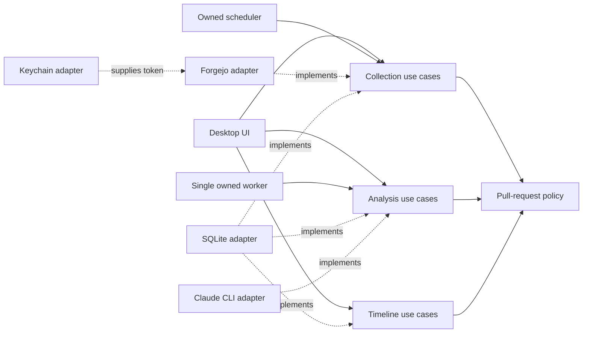

# Target architecture

**Status:** Accepted for the MVP on 16 September 2026

This is the intended production structure. None of the listed Go paths exists
yet. Creating them belongs to accepted implementation tickets after the PRD
demonstrator gate.

## Chosen architecture and fit

PRadar is a single-process modular monolith with explicit ports only at real
external seams. It is not a generic clean-architecture framework: domain and
use-case packages stay independent of the desktop toolkit, Forgejo, SQLite,
macOS Keychain, and Claude CLI, while adapters depend inward on the narrow
interfaces they implement.

A flat package would couple lifecycle policy to five volatile technologies. A
distributed service, event bus, DI container, or generic repository layer would
add operational and conceptual cost without another process, user, or storage
engine to justify it. See [ADR-0001](../adr/0001-modular-monolith-and-manual-wiring.md).

## Modules and public seams

The planned paths below are ownership boundaries, not mandatory one-package-per-
row scaffolding.

| Planned area | Owns | Consumes through |
| --- | --- | --- |
| `internal/pullrequest` | Pull-request identity, analysis identity, lifecycle transitions, publication eligibility | No infrastructure interface |
| `internal/collect` | Subscriptions, polling reconciliation, durable debounce | A forge reader and collection store defined here |
| `internal/analyse` | Claim, workspace preparation, analyzer invocation, validation, retry, completion | Work store, workspace, and analyzer interfaces defined here |
| `internal/timeline` | Timeline/detail queries and read/archive use cases | A read model interface defined here |
| `internal/adapter/forgejo` | Read-only Forgejo HTTP protocol and payload mapping | `net/http` and `internal/collect` contracts |
| `internal/adapter/sqlite` | Transactions, projections, leases, migrations, and local durability | `database/sql` and consuming interfaces |
| `internal/adapter/claudecli` | Bounded Claude subprocess and `pradar.analysis.v1` decoding | `os/exec` and `internal/analyse` contracts |
| `internal/adapter/keychain` | Forgejo token lookup and storage | macOS Keychain API |
| `internal/ui` | Desktop presentation and ephemeral navigation state | Application use cases and query models only |
| `cmd/pradar` | Configuration, constructors, lifecycle, root cancellation, and process exit | Concrete adapters and application modules |

Interfaces live in the package that consumes them. Adapters return concrete
types from constructors. No package named `ports`, `services`, or `common` is
created merely to mirror this table.

## Dependency direction

The solid arrows point toward policy. Dotted arrows are adapter implementations.
Domain packages never import adapters, UI frameworks, SQL, HTTP, process APIs,
or vendor SDKs.

## Composition and lifecycle

`cmd/pradar/main.go` is the sole composition root and uses manual constructor
injection. It opens Keychain access and SQLite, builds adapters and use cases,
starts exactly one polling scheduler and one analysis worker, and finally starts
the desktop UI. No `init()` performs I/O and no global service locator exists.

The root `context.Context` owns every background operation. Shutdown stops new
polls, cancels the active analyzer, waits for owned goroutines within a bounded
grace period, closes SQLite, and removes known temporary workspaces. An
interrupted durable job is recovered after its lease expires.

Startup validates the schema version, confirms the configured analysis engine
is available, recovers expired leases, removes orphaned temporary workspaces,
and performs the PRD's full synchronization before normal polling resumes.

## Migration

1. Run the twenty-pull-request demonstrator and resolve its quality gate. Do not
   copy prototype packages or schemas into `main`.
2. Introduce `internal/pullrequest` with the validated state transitions and
   table-driven behavior tests.
3. Introduce SQLite migrations plus the collection and analysis store
   interfaces, with crash/retry integration tests.
4. Add the Forgejo and Claude adapters behind their consuming ports.
5. Add the composition root, scheduler, and single worker with cancellation and
   restart tests.
6. Add the desktop UI against application use cases and read models.

Each step is a tracer-bullet ticket. Where a contract changes, add the new form,
migrate callers, then remove the old form rather than performing a wide rewrite.

## Linked decisions

- [ADR-0001: Use a modular monolith and manual wiring](../adr/0001-modular-monolith-and-manual-wiring.md)
- [ADR-0002: Use SQLite and leased analysis work](../adr/0002-sqlite-and-leased-analysis-work.md)
- [ADR-0003: Isolate Claude behind a versioned analyzer boundary](../adr/0003-versioned-claude-analyzer-boundary.md)
- [ADR-0004: Persist polling/debounce and publish latest only](../adr/0004-durable-polling-and-latest-only-publication.md)
- [ADR-0005: Isolate untrusted pull-request content](../adr/0005-isolate-untrusted-pull-request-content.md)
